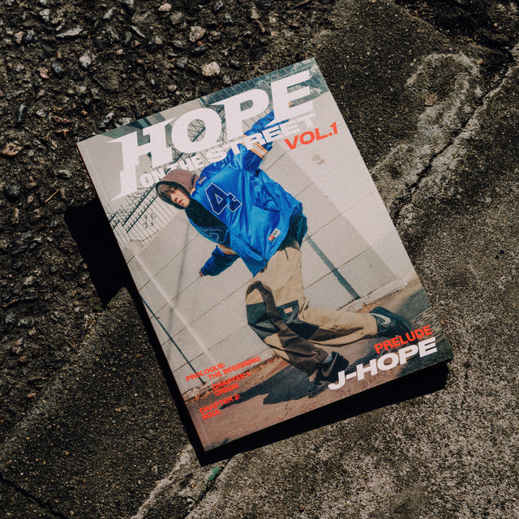

# Hi there 👋, Katherine Siesquen here.
  

  

## &nbsp;***About me***
I am a Software Engineering undergraduate student at **Universidad Nacional Mayor de San Marcos** (4th semester out of 10).  
I’m passionate about learning, creating, and building innovative and productive solutions.

I enjoy working with different technologies and exploring new areas in tech.

* **My main interests are Web Development and Mobile Applications**  
- I’m currently learning:  
  - C++  
  - Java
  - Python 
  - Git 
- I’m looking forward to collaborating on open-source projects.  
- Feel free to ask me anything—I’ll be happy to help (as long as it’s in my field). 
- 📫 Reach out to me at: **katherine.siesquen@unmsm.edu.pe**  

## &nbsp;***My Certificates***

- [**Curso Profesional de Git y GitHub** – Platzi](https://platzi.com/p/katherinest0801/curso/11059-gitgithub/diploma/detalle/)  
  *Completed on Platzi – Covers Git basics, branching, merging, GitHub workflows, and collaboration best practices.*

- [**Curso de C++ Básico** – Platzi](https://platzi.com/p/katherinest0801/curso/2372-course/diploma/detalle/)  

## &nbsp;***Spotify Playing***

  

  

---

## &nbsp;***Contact with me***

   
   

---

[instagram]: https://www.instagram.com/kittyzliz/  
[spotify]: https://open.spotify.com/user/31rxmqinjsdgaezjxxpceyulqvvy?si=llo3BEgtQXynS4BfVcx4_g
